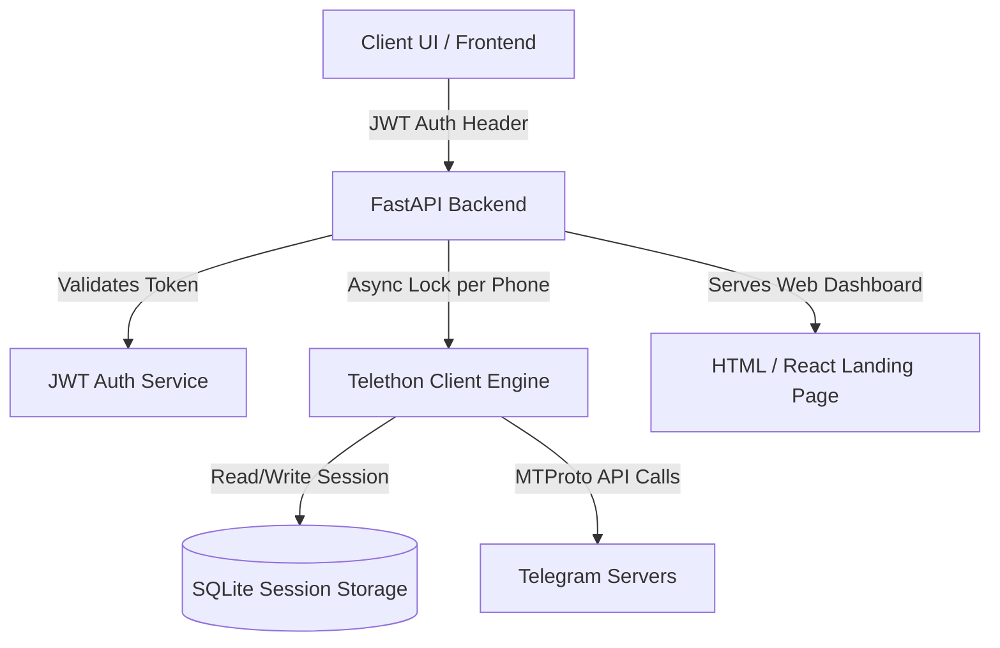

# ✈️ Telegram FastAPI Integration

[](https://fastapi.tiangolo.com)
[](https://github.com/LonamiWebs/Telethon)
[](https://www.python.org/)
[](https://opensource.org/licenses/MIT)

A high-performance, premium **FastAPI** application designed for robust **Telegram** integration, automation, and management. By utilizing **Telethon** under the hood, the system offers complete programmatic control over your Telegram account—managing logins, authentication codes, contacts list exports, live conversations, interactive messaging, and deep file/media exchange.

Equipped with a secure, stateless **JWT Bearer authentication** layer and an automated Telegram "Saved Messages" key delivery system, this integration is ready for both local development and heavy multi-account VPS production deployment.

---

## 🎨 System Architecture



### Key Design Pillars:
* **Stateless JWT Guard**: Authenticaton is stateless. Client gets a persistent token that maps to a specific phone session, keeping API calls secure.
* **Per-Phone Concurrency Lock**: A custom `asyncio.Lock` mechanism safeguards against SQLite multi-write database collisions during heavy concurrent Telethon operations.
* **Integrated Landing Page**: Serves a sleek, modern, dark-themed dashboard template directly from the root path (`/`) with seamless hooks for custom frontend apps.

---

## ✨ Features

* **🔐 Full MTProto Auth Protocol**: Zero-hassle code-request, sign-in, and 2FA password verification.
* **🔑 Secure Token Delivery**: Automatically encrypts and posts your persistent JWT token directly to your **Saved Messages** ("me") chat in Telegram for safe keeping.
* **👥 Contacts Management**: Retrieve and search contacts; supports deep data metadata containing DC IDs, mutual statuses, and profile photos.
* **💬 Rich Chat Operations**: Fetch live dialog lists, search chat histories, send rich markdown text messages, and schedule or send files/media with captions.
* **📅 Historical Filtering**: Read or backup messages from specified date intervals (using `min_date` and `max_date` MTProto filters).
* **🚀 Production VPS Automated Setup**: Includes a fully configured bash script (`setup.sh`) to build Python environments, configure a persistent `systemd` daemon, and deploy immediately.

---

## 🛠️ Local Installation & Setup

If you encountered a `zsh: command not found: python` error, your system uses `python3` for execution. Follow these steps to set up the backend cleanly:

### 1. Clone & Prepare Directory
Make sure your files are placed in the project directory, then navigate inside:
```bash
cd telegram-api
```

### 2. Initialize and Activate Virtual Environment
Use `python3` to initialize the isolated virtual environment:
```bash
# Create the environment
python3 -m venv venv

# Activate on macOS / Linux:
source venv/bin/activate

# Or activate on Windows (Command Prompt):
# .\venv\Scripts\activate
# Or Windows (PowerShell):
# .\venv\Scripts\Activate.ps1
```

### 3. Install Dependencies
Ensure you have the latest `pip` and install the package requirements:
```bash
pip install --upgrade pip
pip install -r requirements.txt
```

### 4. Run the Dev Server
Launch the application with live reload enabled:
```bash
uvicorn main:app --reload --port 9000
```
* The API will be accessible at: `http://localhost:9000`
* Access interactive Swagger Documentation at: `http://localhost:9000/docs`
* Access the built-in Dashboard Page at: `http://localhost:9000/`

---

## ⚙️ Environment Variables (`.env`)

Create a `.env` file in the root folder (using `example.env` as a base). Fill out your specific Telegram API App credentials:

```ini
# Telegram API Credentials (obtain from https://my.telegram.org)
API_ID=20295429
API_HASH=508dea8a3dcdc08291f71cd30e4bebe1

# Application Secrets
SECRET_KEY=your-custom-very-secure-jwt-secret-key-123
SESSION_NAME=tele_session

# Optional Local URLs
BASE_URL=http://localhost:9000
```

> 💡 **Where do I get my API ID & Hash?**  
> Go to [my.telegram.org](https://my.telegram.org), log in with your phone number, click on **API development tools**, create an app profile, and copy the `api_id` and `api_hash`.

---

## 🔒 The Saved Messages JWT Flow

To eliminate complex session handshakes, the application employs a highly innovative **Saved Messages JWT flow**:

1. **Initiate**: You POST the phone number to `/login`. Telegram delivers an OTP code.
2. **Verify**: You verify the code (and 2FA password, if enabled) via `/verify`.
3. **Delivery**: The backend generates a stateless JWT and calls the Telethon client to post a secure, formatted message containing this key directly into your **Saved Messages** conversation:
   
   ```text
   🔐 Persistent API Token 🔐

   This token will work until:
   1. You log out of Telegram
   2. Delete this session

   Token: eyJhbGciOiJIUzI1NiIsInR5cCI6IkpXVCJ9...
   Account: +1234567890
   
   ⚠️ Keep this secure - it won't expire automatically.
   ```
4. **Authorize**: For all future requests, simply pass this token inside the header: `Authorization: Bearer <your_jwt_token>`.

### 🔗 5. Instant SSO Auto-Login (Single Sign-On)
The Web Console Dashboard supports full **Single Sign-On (SSO)** auto-login out of the box:
* **Usage**: Simply navigate to the root dashboard URL appending the JWT token as a query parameter, for example:
  ```text
  http://localhost:9000/?token=eyJhbGciOiJIUzI1NiIsInR5cCI6IkpXVCJ9...
  ```
* **Mechanism**: On page boot, the Single Page Application automatically:
  1. Parses and extracts the token from the URL.
  2. Runs client-side base64 JWT parsing to resolve the active phone account.
  3. Writes the token and phone session securely to `localStorage` for future API calls.
  4. Performs a silent `window.history.replaceState` rewrite to remove the `token` parameter from the address bar, preventing token leaks in URL sharing or browser history logs.
  5. Bypasses the login screens completely, launching the dashboard panel instantly.

---

## 🔌 API Endpoint Reference

All protected API paths require the `Authorization: Bearer <token>` header.

### 🔑 Authentication (`Telegram Auth`)

#### 1. Request OTP Code
* **Endpoint**: `POST /login`
* **Request Body**:
  ```json
  {
    "phone_number": "+1234567890"
  }
  ```
* **Response (200 OK)**:
  ```json
  {
    "message": "Code sent to Telegram",
    "phone_code_hash": "a1b2c3d4e5f6..."
  }
  ```

#### 2. Verify Code & Obtain JWT
* **Endpoint**: `POST /verify`
* **Request Body**:
  ```json
  {
    "phone": "+1234567890",
    "code": "12345",
    "password": "your_2fa_password_if_enabled",
    "phone_code_hash": "a1b2c3d4e5f6..."
  }
  ```
* **Response (200 OK)**:
  ```json
  {
    "access_token": "eyJhbGciOiJI...",
    "persistent": true,
    "message": "Token saved to Telegram saved messages"
  }
  ```

#### 3. Check Session Status
* **Endpoint**: `GET /telegram/status`
* **Response (200 OK)**:
  ```json
  {
    "is_logged_in": true,
    "user": "telegram_username"
  }
  ```

#### 4. Terminate Session
* **Endpoint**: `POST /logout`
* **Response (200 OK)**:
  ```json
  {
    "message": "Logged out",
    "success": true
  }
  ```

#### 5. Renew Persistent Token
* **Endpoint**: `POST /renew-token`
* **Headers**: `Authorization: Bearer <your_jwt_token>`
* **Response (200 OK)**:
  ```json
  {
    "access_token": "eyJhbGciOiJI...",
    "persistent": true,
    "message": "Token renewed successfully and saved to Telegram saved messages"
  }
  ```

---

### 👤 Profile & User Data (`Telegram User`)

#### 1. Current Account Info
* **Endpoint**: `GET /me`
* **Response (200 OK)**:
  ```json
  {
    "user": {
      "id": 123456789,
      "first_name": "John",
      "last_name": "Doe",
      "username": "johndoe",
      "phone": "1234567890",
      "is_bot": false,
      "verified": false,
      "status": "UserStatusOnline"
    }
  }
  ```

#### 2. Get Contacts List
* **Endpoint**: `GET /list-contacts`
* **Response (200 OK)**:
  ```json
  {
    "contacts": [
      {
        "id": 987654321,
        "first_name": "Jane",
        "last_name": "Smith",
        "username": "janesmith",
        "phone": "1987654321",
        "mutual_contact": true,
        "is_user": true,
        "is_bot": false,
        "status": "UserStatusRecently"
      }
    ]
  }
  ```

---

### 💬 Dialogs & Messaging (`Telegram Chats`)

#### 1. Get Live Chats & Channels
* **Endpoint**: `GET /list-chats`
* **Response (200 OK)**:
  ```json
  [
    {
      "id": -100123456789,
      "name": "My Automation Channel",
      "title": "My Automation Channel"
    }
  ]
  ```

#### 2. Get Created/Owned Groups & Channels
* **Endpoint**: `GET /chats/list-own`
* **Headers**: `Authorization: Bearer <your_jwt_token>`
* **Response (200 OK)**:
  ```json
  [
    {
      "id": -100123456789,
      "name": "My Owned Supergroup",
      "title": "My Owned Supergroup",
      "type": "supergroup/channel",
      "username": "my_supergroup_username"
    }
  ]
  ```

#### 3. Send Text Message
* **Endpoint**: `POST /chats/message/send`
* **Request Body**:
  ```json
  {
    "chat_id": 987654321,
    "message": "Hello from FastAPI!"
  }
  ```
* **Response (200 OK)**:
  ```json
  {
    "success": true,
    "message_id": 456,
    "chat_id": 987654321,
    "date": "2026-05-24T14:20:00Z"
  }
  ```

#### 4. Send Document or File
* **Endpoint**: `POST /chats/message/send-file`
* **Request Body**:
  ```json
  {
    "chat_id": 987654321,
    "file_path": "/absolute/path/to/report.pdf",
    "caption": "Quarterly Performance Report"
  }
  ```
* **Response (200 OK)**:
  ```json
  {
    "success": true,
    "message_id": 457,
    "chat_id": 987654321,
    "date": "2026-05-24T14:21:00Z"
  }
  ```

#### 5. Delete Message
* **Endpoint**: `POST /chats/message/delete`
* **Request Body**:
  ```json
  {
    "chat_id": 987654321,
    "message_id": 456
  }
  ```
* **Response (200 OK)**:
  ```json
  {
    "success": true,
    "deleted": 1
  }
  ```

#### 6. Invite User to Group / Channel
* **Endpoint**: `POST /chats/invite`
* **Request Body**:
  ```json
  {
    "chat_id": -100123456789,
    "user_id": "username_or_phone_or_numeric_id"
  }
  ```
* **Response (200 OK)**:
  ```json
  {
    "success": true,
    "message": "Successfully invited user 'username_or_phone_or_numeric_id' to group/channel '-100123456789'"
  }
  ```

#### 7. Remove User from Group / Channel
* **Endpoint**: `POST /chats/remove-user`
* **Request Body**:
  ```json
  {
    "chat_id": -100123456789,
    "user_id": "username_or_phone_or_numeric_id"
  }
  ```
* **Response (200 OK)**:
  ```json
  {
    "success": true,
    "message": "Successfully removed user 'username_or_phone_or_numeric_id' from group/channel '-100123456789'"
  }
  ```

#### 8. List Chat History (Filtered by Type)
* **Endpoint**: `GET /chats/list-messages/{chat_type}`
* **Path Parameters**:
  * `chat_type`: `all` | `media` | `text`
* **Query Parameters**:
  * `chat_id`: The integer ID of target chat/group.
* **Response (200 OK)**:
  ```json
  {
    "chat_id": 987654321,
    "total_messages": 2,
    "messages": [
      {
        "id": 456,
        "date": "2026-05-24 14:20:00+00:00",
        "text": "Hello from FastAPI!",
        "sender_id": 123456789,
        "sender_name": "John Doe",
        "media": false,
        "reply_to": null
      }
    ]
  }
  ```

#### 9. Export Messages by Specific Date Range
* **Endpoint**: `POST /chats/list-message/by-date`
* **Request Body**:
  ```json
  {
    "chat_id": 987654321,
    "date_from": "2026-05-01T00:00:00",
    "date_to": "2026-05-24T23:59:59"
  }
  ```
* **Response (200 OK)**:
  ```json
  {
    "messages": [...]
  }
  ```

#### 10. Download or Stream Message Media
* **Endpoint**: `GET /chats/media/download`
* **Headers**: `Authorization: Bearer <your_jwt_token>`
* **Query Parameters**:
  * `chat_id`: The integer ID of target chat/group.
  * `message_id`: The integer ID of the specific message.
* **Response (200 OK)**:
  * Binary stream / file of the media item (e.g., JPEG, MP4, PDF, OGG) served with high-performance caching.

---

## 🚢 Production VPS Deployment

Deploying the service to a VPS server is extremely simplified using the integrated automated setup tool:

1. **Verify VPS Prerequisites**:
   Ensure you have `python3` and `python3-venv` installed on your machine:
   ```bash
   sudo apt update
   sudo apt install -y python3-pip python3-venv python3-dev
   ```

2. **Configure `.env` File**:
   Before triggering the installation daemon, create a valid production `.env` under your application root (`~/telegram-api/.env`).

3. **Trigger Installation Daemon**:
   Make the deploy script executable and execute it:
   ```bash
   chmod +x setup.sh
   ./setup.sh
   ```

### What does `setup.sh` do under the hood?
* Installs all Python modules listed inside a production-level environment.
* Configures and starts a background daemon for continuous execution.
* Creates a systemd service file at `/etc/systemd/system/telegram-api.service`.
* Registers the application to automatically start up when the server reboots.

### Service Maintenance
```bash
# Check running service status
sudo systemctl status telegram-api

# Stream active logs in real-time
journalctl -u telegram-api -f

# Manage service state
sudo systemctl restart telegram-api
sudo systemctl stop telegram-api
sudo systemctl start telegram-api
```

---

## 🎨 Dashboard Web Integration

The FastAPI integrates perfectly with custom web dashboards:

* **Static Landing Page**: A fully responsive dashboard template is served by default at `/` pointing to files under `web/index.html`.
* **SPA React Integration**: If a folder named `telegram-dashboard/build` exists in the project root, the FastAPI server will automatically mount `/static` assets and host client-side routing on the `/web` prefix pathway. Refer to [frontend-docs.md](file:///Users/apple/Desktop/telegram-api/frontend-docs.md) for more details.

---

## 📄 License
Licensed under the [MIT License](LICENSE).